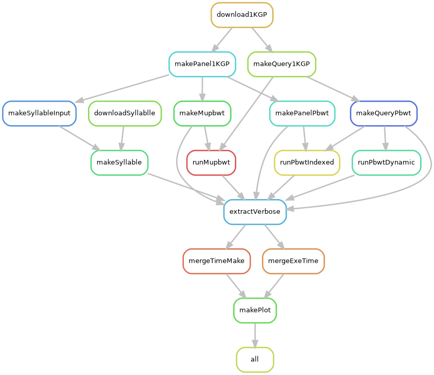

# muPBWT-1KGP-workflow

[Snakemake](https://doi.org/10.12688/f1000research.29032.1) workflow for testing 
[μ-PBWT](https://github.com/dlcgold/muPBWT) against Durbin's 
[PBWT](https://github.com/richarddurbin/pbwt) and 
[Syllable-PBWT](https://github.com/ZhiGroup/Syllable-PBWT) on 
[1000 Genome Project phase 3 data](https://doi.org/10.1038/nature15393), available at this 
[link](https://ftp.1000genomes.ebi.ac.uk/vol1/ftp/release/20130502/).

## Run pipeline
Snakemake need to be already installed.
```shell
cd muPBWT-1KGP-workflow
snakemake -j <#jobs> --use-conda
```

In `results/` it will be generated some results:
- in `results/data` some useful CSV files
- in `results/plots` some plots in PDF format
- in `results/tables` some tables in LaTeX syntax

## Pipeline overview

